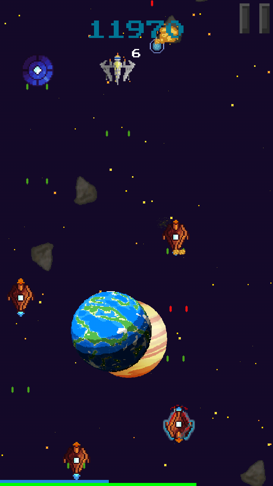
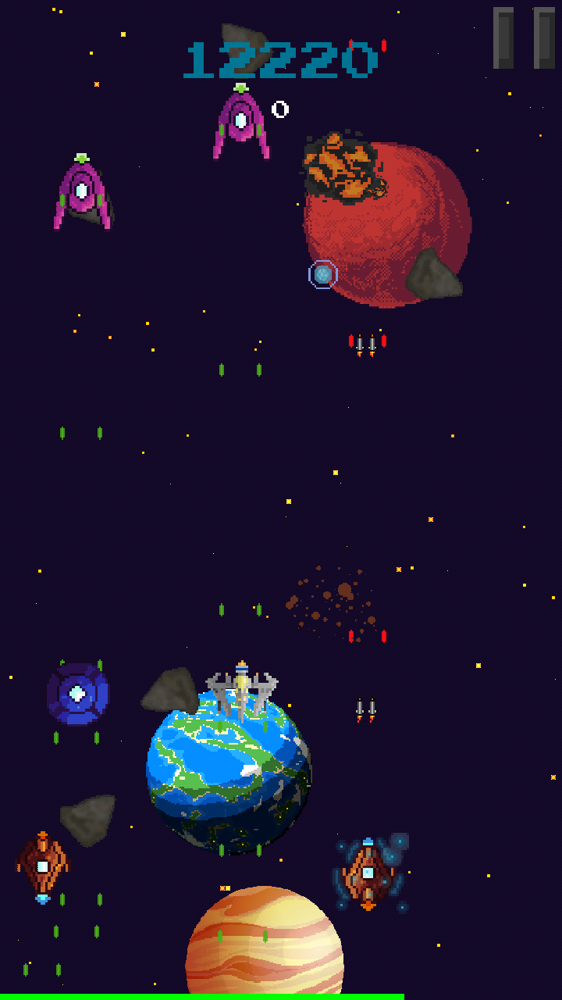

# Spaceshooter

- [Spaceshooter](#spaceshooter)
  - [Building for Android](#building-for-android)
  - [Building for PC](#building-for-pc)
  - [Connecting to the scoreboard](#connecting-to-the-scoreboard)

__Spaceshooter__ - shoot 'em up/bullet hell game written in java using libgdx.

As in any game of this genre, the main goal here is as follows: to score as many points as possible.

In-game screenshots:

## Building for Android

1. Open visual studio
2. Click build
3. Run the game

## Building for PC

Libxgd provides convenient ways to run the game on any platform. Thus it is possible to run the game on the desktop computer.

To do so you need to (in android studio):

1. Click on edit configurations
2. Add configuration
3. Application
4. Select DesktopLauncher as main class
5. Set working directory to be `./android/assets`
6. As a module classpath select Desktop
7. Click OK

## Connecting to the scoreboard

1. Use instructions for the server component: [scoreboard-server](https://github.com/m4drat/spaceshooterserver)
2. In the game settings enter your server address.
